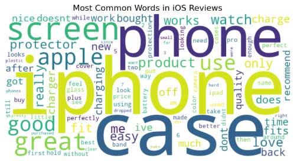
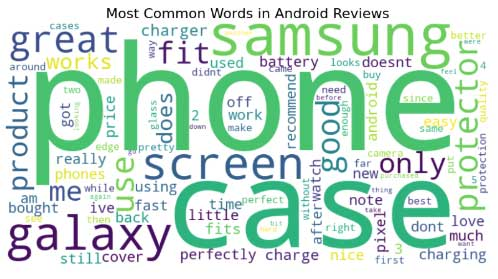

# 📊 Big Data Analytics Project: Amazon Reviews Analysis 📱💻

Welcome to our **Big Data Analytics Project**! 🚀 This project studies the ever-persistent **iOS vs Android debate** by analyzing user behavior, sentiments, and preferences using Amazon reviews for cell phones and accessories. 📱✨

---

## 🌟 Project Highlights

- **📁 Dataset**: [Amazon Reviews - Cell Phones and Accessories](https://huggingface.co/datasets/McAuley-Lab/Amazon-Reviews-2023) (~9GB of big data!)
- **🔍 Focus**: Sentiment analysis, user behavior trends, and platform comparisons.
- **🛠️ Technologies**:
  - **Hadoop** 🐘 (HDFS for data storage)
  - **PySpark** 🔥 (Data processing and analytics)
  - **Pandas & Matplotlib** 📊 (Data cleaning and visualization)

---

## 🚀 Workflow Overview

1. **Data Preprocessing**:
   - JSON to CSV conversion.
   - Data cleaning: Missing values, outliers, and invalid timestamps.
   - Feature engineering: Sentiment classification and platform categorization.
2. **Data Analysis**:
   - Sentiment mapping (positive, neutral, negative).
   - Behavioral analysis of Android vs iOS users.
3. **Visualization**:
   - Word clouds 🌈
   - Sentiment distribution graphs 📉
   - Time-series trends ⏳

---

## 🖼️ Visual Insights

- **iOS Users**: Focus on aesthetics and brand loyalty (keywords like *"perfect," "fit," "Apple"*).
- **Android Users**: Practicality and functionality (keywords like *"battery," "Samsung," "work"*).

🎨 *Sample Visualizations:*

---

## 🧑‍🤝‍🧑 Contributors

A big shoutout to our amazing team! 🌟

- **Sam El Saati** 🎯
  - Specialization: Feature engineering & data cleaning, system optimization, and sentiment analysis.
  - 🌐 GitHub: [github.com/sams258](https://github.com/sams258)
- **Mohamad Alloush** 🌍
  - Specialization: Data cleaning & feature engineering, visualization, and storytelling through analytics.
  - 🌐 GitHub: [github.com/alloush95](https://github.com/alloush95)

---

## 🛠️ Challenges & Lessons

- **Data Volume**: Managing a massive 9GB dataset with limited resources. 🗃️
- **System Crashes**: Overcame memory limitations with optimized configurations. 🛠️
- **Visualization Complexity**: Simplified insights for clear and actionable outcomes. 🎨

---

## 💡 Key Takeaways

- **Actionable Insights**:
  - Android users prioritize functionality and value.
  - iOS users emphasize aesthetics and premium experience.
- **Technical Growth**:
  - Mastery of Hadoop and PySpark.
  - Hands-on experience with big data tools and techniques.

---

## 📥 How to Use

1. Clone this repository:
   git clone [https://github.com/sams258/Big-Data-Analytics-Project](https://github.com/sams258/Big-Data-Analytics-Project)
2. Install dependencies and set up Hadoop and PySpark.
3. Run analysis scripts (Jupyter notebook) and visualize insights.

---

## 📝 References

- [Hadoop Documentation](https://hadoop.apache.org/docs/stable/hadoop-project-dist/hadoop-common/SingleCluster.html)
- [PySpark Quick Start Guide](https://spark.apache.org/docs/latest/quick-start.html)
- [Pandas Documentation](https://pandas.pydata.org/docs/user_guide/index.html)
- [Amazon Reviews Dataset](https://huggingface.co/datasets/McAuley-Lab/Amazon-Reviews-2023)

---

⭐ Don't forget to give this project a star if you find it useful! ✨

